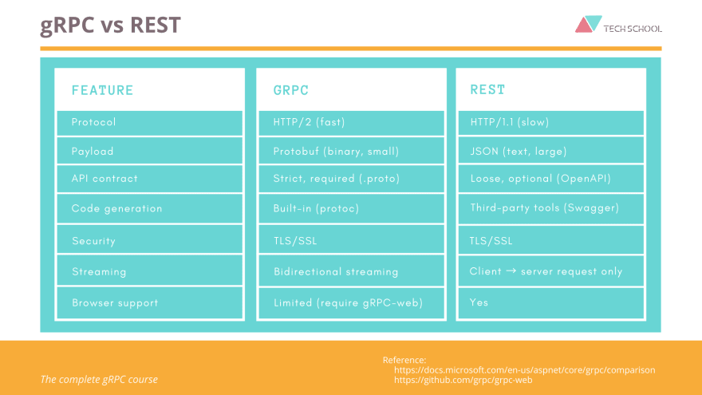

# gRPC client - server repository
In this repo, you're going to find a practice example of gRPC.

## What is gRPC?
RPC = Remote Procedure Call...  
gRPC is a framework used to connect services IN and ACROSS server machines.  
In general terms, RPC is not new, it was created some years ago but now it's been improved and continuously updated by 
the cloud native computing foundation.

Currently, we mostly use REST to connect services across a microservices architecture but now gRPC has arrived as an 
alternative with some advantages:

The main differences are:
1. gRPC uses the protocol HTTP/2 (which makes it faster and bidirectional) instead of HTTP/1
2. In gRPC, the payload is Protobuf, which is smaller than JSON used by REST

But not all are advantages...
When you start using gRPC, you will notice that there is not an easy way to consume and see the documentation of the 
methods exposed in a server (something like a swagger in REST).  
In addition, the creation process of proto files is boring, the current plugins are not very accurate or sophisticated
enough and, at least nowadays, there is no way to use annotations over a POJO class to mark it as a proto message 
(as in REST).  

## What is the structure of this repository? 
The goal is to have 2 projects:
* **grpc-client**: This project will contain the client part, I mean, the code in this project is going to *consume*
the gRPC methods exposed by the grpc-server prject.

* **grpc-server**: This project will contain the server part, in this code, we're going to expose some methods via gRPC
in order to be consumed by the grpc-client.
